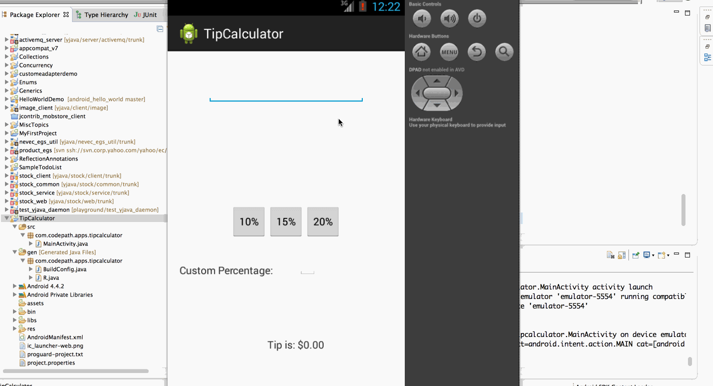

# Tip Calculator App Demo

This is the second android app for tip calculator.

Time spent: 4 hours spent in total

Completed user stories:
 * User is displayed the tip of specified percentage for specified entered amount
 * User enters the total amount of the transaction
 * User can select between tip amounts (i.e 10%, 15%, 20%)
 * Upon selecting tip amount, formatted tip value is displayed
 * (Optional) User changes the total amount and updated tip is reflected automatically
 * (Optional) User can select custom tip percentage if desired

Walkthrough of all user stories:

GIF created with [LiceCap](http://www.cockos.com/licecap/).
